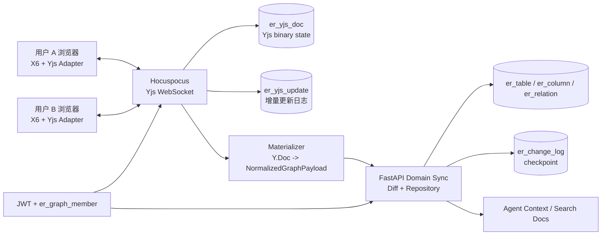

# ER 图 Yjs 多用户协同编辑方案

## Slide 1：标题页

标题：ER 图 Yjs 多用户协同编辑方案

副标题：X6 画布实时协同、结构化物化、历史恢复与轻量用户权限

视觉：深色画布背景 + 两个用户同时编辑同一 ER 图的抽象界面。

## Slide 2：当前架构与问题

- 当前：浏览器 X6 画布通过 `sync/canvas` 保存完整画布 payload。
- 问题：单用户 autosave 无法表达多人实时变更。
- 问题：多人同时编辑容易形成覆盖式保存和版本冲突。
- 问题：在线状态、选中对象、只读权限没有实时反馈。

## Slide 3：目标架构图

## Slide 4：数据模型图

- `app_user`：本地账号。
- `er_graph_member`：图成员角色，`owner/editor/viewer`。
- `er_yjs_doc`：每个 graph 一份 Yjs binary state。
- `er_yjs_update`：增量 update 审计，记录 `user_id/client_id/update_size/origin`。
- `er_table/er_column/er_relation`：结构化读模型，服务历史、Agent 和 API。

## Slide 5：编辑数据流

1. 用户在 X6 画布编辑表、字段、关系或节点位置。
2. 前端 adapter 写入 Yjs transaction。
3. Hocuspocus 广播 update 到同一 graph room。
4. 远端浏览器将 Y.Doc 投影回 X6 graph。
5. sidecar debounce 保存 binary，并调用 FastAPI internal materialize。
6. FastAPI 复用 Domain diff 写结构化表、change log 和 checkpoint。

## Slide 6：冲突与恢复策略

- 实时冲突由 Yjs CRDT 合并。
- `viewer` 连接 room 但由服务端 readOnly 限制写入。
- HTTP `sync/canvas` 保留为非协同兜底和兼容路径。
- checkpoint restore 后删除旧 Yjs binary/update，下一次协同加载从结构化快照重新 seed。
- materialize 失败不影响当前在线协同，但前端显示持久化异常。

## Slide 7：实施里程碑

- Phase 1：轻量用户/JWT/图成员权限。
- Phase 2：Hocuspocus sidecar + PostgreSQL Yjs binary/update。
- Phase 3：前端 X6/Yjs adapter + 在线成员/连接状态。
- Phase 4：Y.Doc 物化到现有 Domain diff/history/Agent context。
- Phase 5：checkpoint restore 与双浏览器协同测试。
- Phase 6：awareness polish、成员管理 UI、后续 OIDC/SSO 替换。
